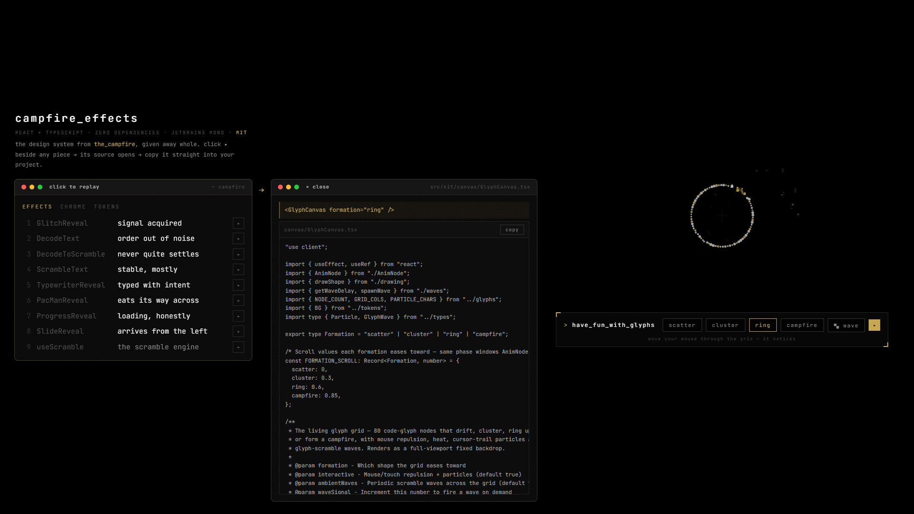

# campfire_effects

The design system from the_campfire, a site I built and then retired. The fun parts deserved better than a dead repo, so here they are: eight glitchy text effects, a living glyph grid, and the terminal chrome that framed them. React + TypeScript, zero dependencies, MIT.

**Have a play:** https://glitch-cat-club.github.io/campfire-effects/

Click the small ▸ next to anything and its source opens beside it, ready to copy into your own project. Everything liftable lives in `src/kit/` and is self-contained. The grid notices your mouse, and the buttons underneath reshape it: scatter, cluster, ring, campfire.

To run it locally: `npm install`, then `npm run dev`.

MIT, so do what you like with it. A mention is nice, never required.

Kem · [Glitch Cat Club](https://glitchcatclub.com)
